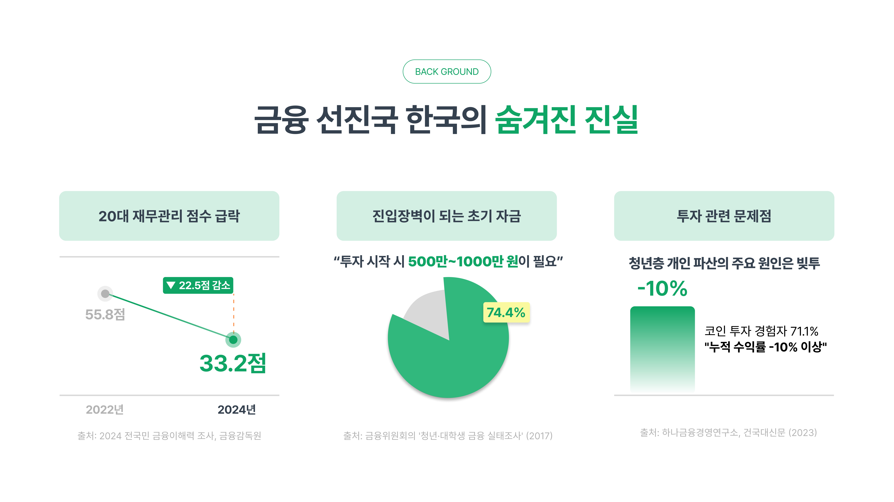
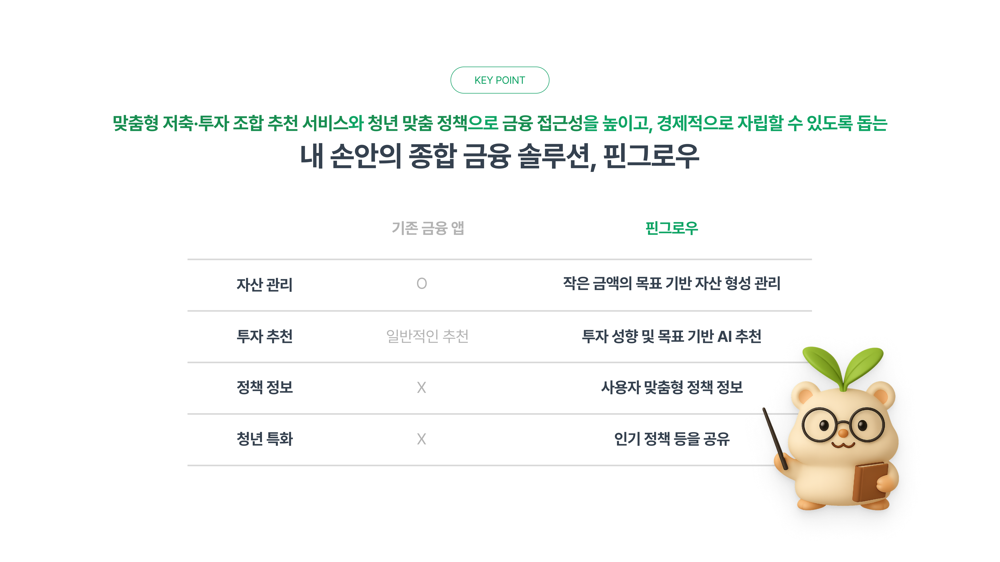
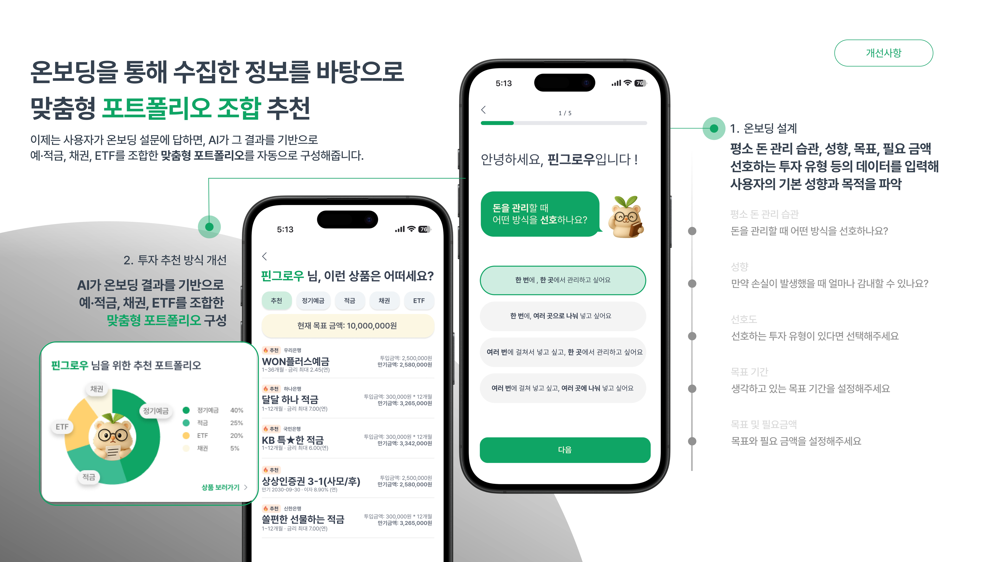
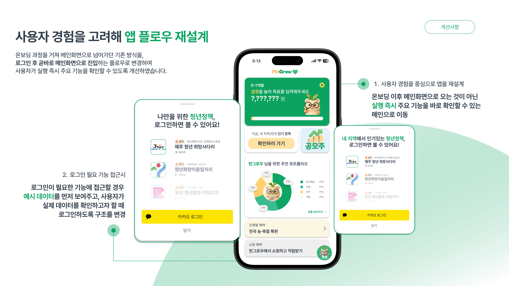
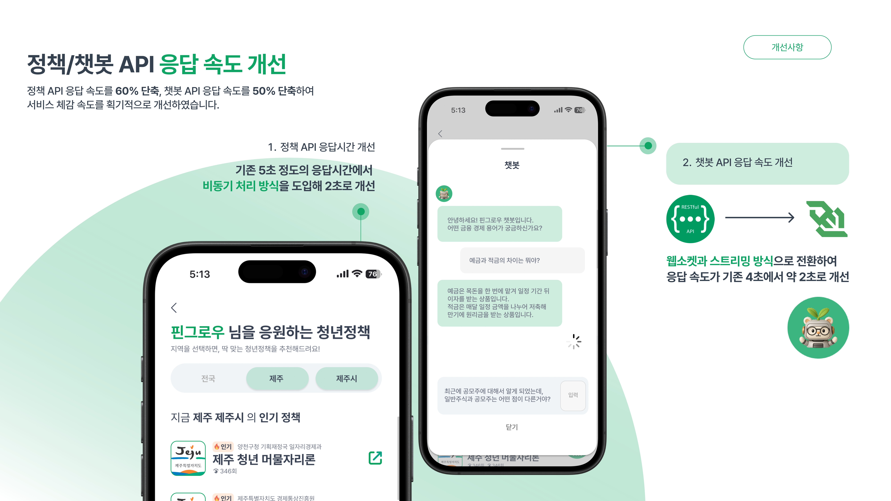
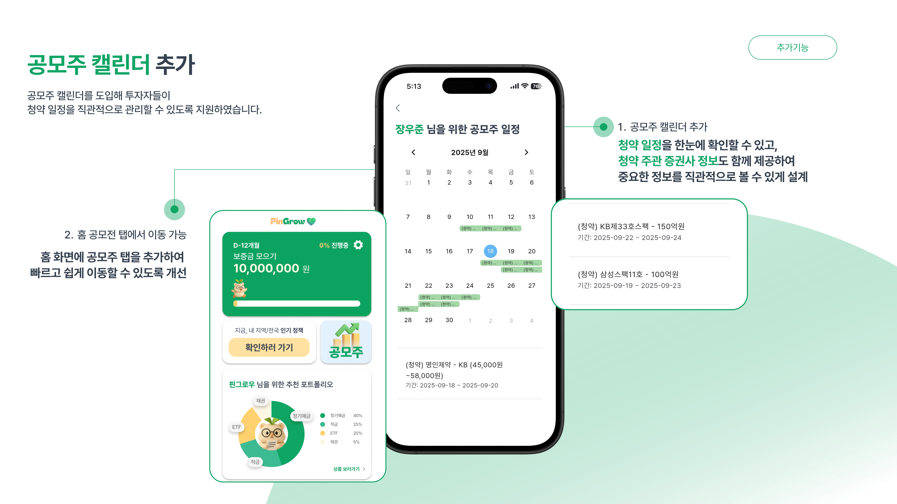
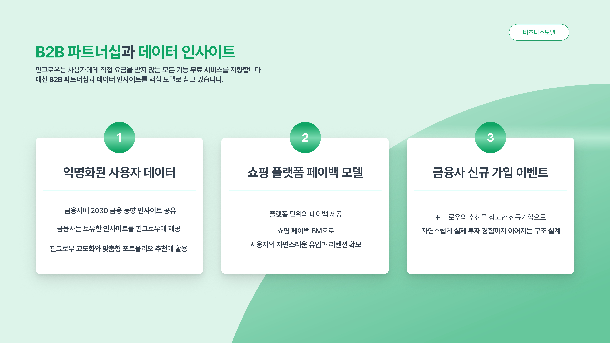
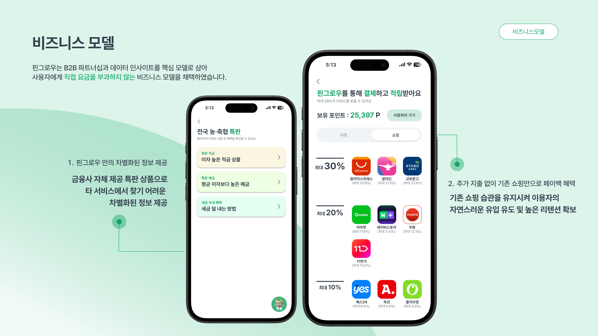
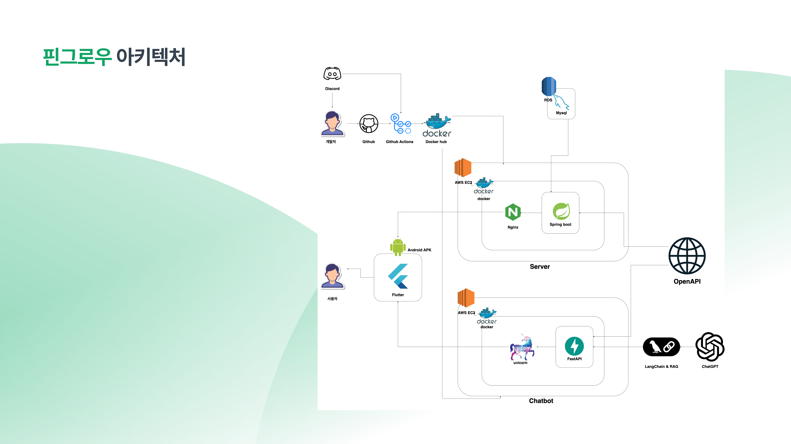

# [2025 kakao X 9oorm 시즌톤] 55팀 핀그로우(PinGrow)

[핀그로우(PinGrow) FE 레포지토리 바로가기](https://github.com/9oormthon-univ/2025_SEASONTHON_TEAM_55_FE)
<br/>
[핀그로우(PinGrow) AI 레포지토리 바로가기](https://github.com/9oormthon-univ/2025_SEASONTHON_TEAM_55_AI)

## 당신의 미래를 키우는 작은 씨앗, 핀그로우(PinGrow) 🌱

> "Pin + Grow = 청년들의 금융 지식을 키우는 작은 씨앗"












## 핀그로우 아키텍처



## 프로젝트 구조

```
src/
 └── main/
     ├── java/com/fingrow/
     │   ├── domain/
     │   │   ├── financial/
     │   │   │   ├── bond/
     │   │   │   │   ├── controller/   # 채권 API 컨트롤러
     │   │   │   │   ├── dto/          # 채권 관련 DTO
     │   │   │   │   └── service/      # 채권 서비스 로직
     │   │   │   ├── deposit/
     │   │   │   │   ├── controller/   # 예·적금 API 컨트롤러
     │   │   │   │   ├── dto/          # 예·적금 DTO (상품/옵션/추천 응답 등)
     │   │   │   │   ├── entity/       # 예·적금 엔티티 (Deposit, Saving)
     │   │   │   │   ├── repository/   # JPA 리포지토리
     │   │   │   │   └── service/      # 예·적금 서비스 + 설정 클래스
     │   │   │   └── etf/
     │   │   │       ├── controller/   # ETF API 컨트롤러
     │   │   │       ├── dto/          # ETF DTO
     │   │   │       ├── entity/       # ETF 엔티티
     │   │   │       ├── repository/   # ETF 리포지토리
     │   │   │       └── service/      # ETF 서비스 로직
     │   │   ├── onboard/
     │   │   │   ├── controller/       # 온보딩 API 컨트롤러
     │   │   │   ├── dto/              # 온보딩 관련 DTO
     │   │   │   ├── entity/           # 투자 성향 엔티티
     │   │   │   ├── repository/       # 투자 성향 리포지토리
     │   │   │   └── service/          # 온보딩 서비스 로직
     │   │   ├── test.controller/      # 테스트용 카카오 컨트롤러
     │   │   └── user/
     │   │       ├── controller/       # 사용자 인증 컨트롤러
     │   │       ├── dto/              # 사용자 DTO
     │   │       ├── entity/           # 사용자 엔티티
     │   │       ├── repository/       # 사용자 리포지토리
     │   │       └── service/          # 카카오 OAuth 서비스
     │   └── global/
     │       ├── config/               # 전역 설정 (CORS, Security, OpenAPI 등)
     │       ├── enums/                # 투자 관련 Enum (RiskLevel 등)
     │       ├── security/             # JWT 필터 등 보안 설정
     │       └── util/                 # JWT 유틸 클래스
     │
     └── resources/
         ├── static/                   # 정적 파일
         │   └── test/                 # 카카오 로그인 테스트 HTML
         └── application.yml           # 스프링 부트 설정

```

## 주요 기능

### 🔑 1. 카카오 OAuth2 로그인 & JWT 인증

- 데이터소스: 카카오 OAuth2 API
- 기술스택: Spring Security + JWT
- 핵심기능:
  - 카카오 로그인 연동
  - Access/Refresh Token 발급 및 갱신
  - 사용자 정보 조회 및 관리

### 💰 2. 금융상품 조회 및 검색

- 데이터소스: 금융상품 API (예금·적금, 채권, ETF)
- 기술스택: Spring Boot + JPA
- 핵심기능:
  - 예금/적금 상품 및 옵션 조회
  - 채권 및 ETF 데이터 조회
  - 검색 기능 제공

### 📊 3. 투자 성향 온보딩

- 데이터소스: 사용자 온보딩 설문 결과
- 기술스택: Enum 기반 RiskLevel/InvestmentType
  핵심기능:
  - 투자 성향 분석 (안정형, 안정추구형, 위험중립형, 적극투자형, 공격투자형 등)
  - 성향 데이터 저장 및 이후 추천 서비스와 연계

### ⚙️ 4. 전역 설정 및 보안
- 구성요소: Config, Enums, Security, Util
- 기술스택: Spring Security, OpenAPI (Swagger), AsyncConfig
- 핵심기능:
  - JWT 인증 필터 및 보안 설정
  - Swagger 기반 API 문서화
  - 비동기 처리 및 글로벌 설정 관리

## 기술스택

Backend

- Java 17
- Spring Boot
- Spring Data JPA (MySQL)
- Spring Security (OAuth2 + JWT)
- Docker, Docker Compose
- Springdoc OpenAPI (Swagger)

Infra & Config

- Gradle (빌드 및 의존성 관리)
- RestTemplate / Jackson (외부 API 연동, JSON 처리)
- AsyncConfig, CorsConfig, SecurityConfig

## 핀그로우 Team

|                                                               팀장/기획/BE                                                               |                                                                디자인/BE                                                                 |                                                                  BE/Ops                                                                  |                                                                   FE                                                                    |
| :--------------------------------------------------------------------------------------------------------------------------------------: | :--------------------------------------------------------------------------------------------------------------------------------------: | :--------------------------------------------------------------------------------------------------------------------------------------: | :-------------------------------------------------------------------------------------------------------------------------------------: |
|  |  |  |  |
|                                                                  강동주                                                                  |                                                                  김이슬                                                                  |                                                                  김민균                                                                  |                                                                 장우준                                                                  |
|                                              [@soltyspring](https://github.com/soltyspring)                                              |                                                   [@2sseul](https://github.com/2sseul)                                                   |                                                [@dirak4545](https://github.com/dirak4545)                                                |                                               [@lambda127](https://github.com/lambda127)                                                |